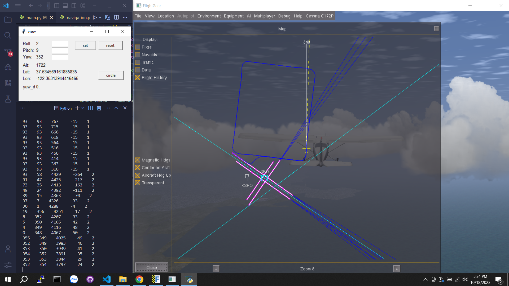

# Flightgear-simulation
Chương trình mô phỏng, điều khiển dẫn đường cho máy bay cánh bằng trên phần mềm bay giả lập Flightgear sử dụng python
- Bay bám theo tọa độ thiết lập sẵn
- Bay vòng tròn Loiter
- ...

