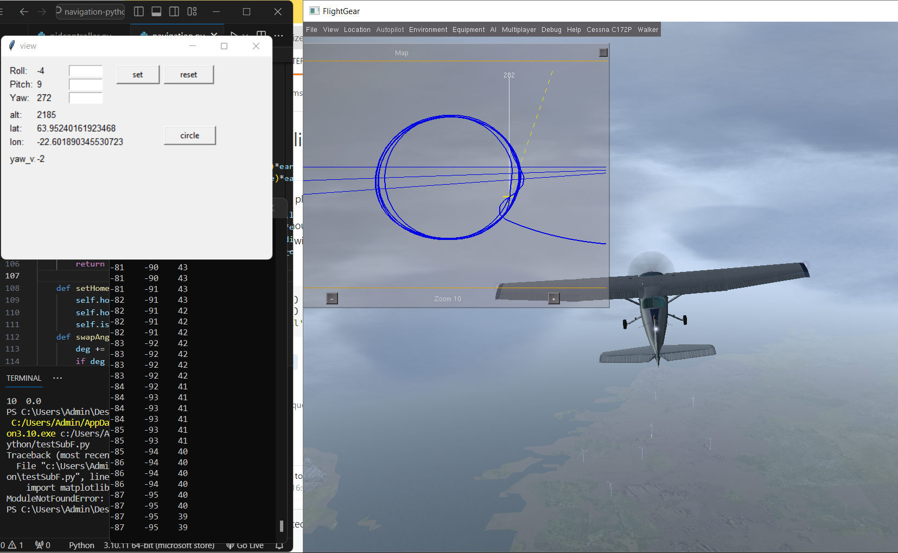
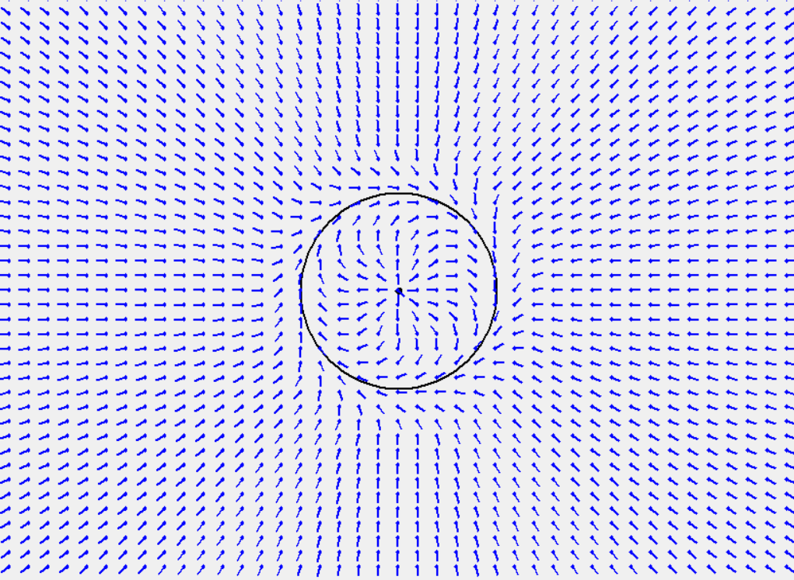
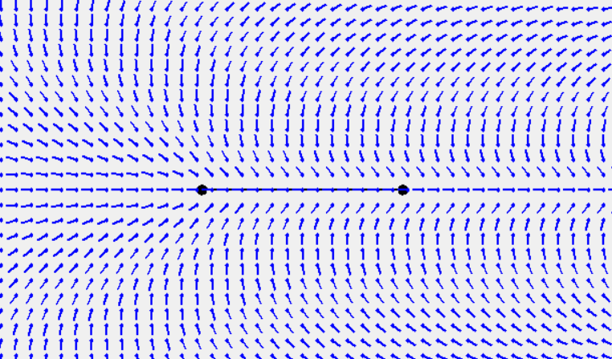

# Flightgear-simulation
Chương trình mô phỏng, điều khiển dẫn đường cho máy bay cánh bằng trên phần mềm bay giả lập Flightgear sử dụng python

**Chức năng cơ bản*
- Bay bám theo tọa độ thiết lập sẵn
- Bay vòng tròn Loiter
- ...


# Thuật toán dẫn đường
+ Phương pháp vector tọa độ "Vector Field Guidance"
+ Tham khảo bài báo "Autonomous Waypoint-based Guidance
Methods for Small Size Unmanned Aerial
Vehicles" [https://acta.uni-obuda.hu/Stojcsics_56.pdf]
+ file 'vectorGeneration.py' sử dụng để vẽ các vector thiết lập thử các hệ số 
+ Điều khiển máy bay bám theo hướng các vector [hình 1] bay vòng tròn,  [hình 2] bay bám quỹ đạo 


   
   <br clear="left"/>
     

# Cài đặt 
1. Trên window
```c
pip install flightgear-python
``````
1. Clone repo [https://github.com/julianneswinoga/flightgear-python]
 có các ví dụ trong example 
1. Cài đặt phần mềm Flightgear
   tại [https://www.flightgear.org/download/]
# Ví dụ
- Mở flightgear bằng cmd trong folder bin (thư mục cài đặt) [C:\Program Files\FlightGear 2020.3\bin]
  ```c
    fgfs --native-fdm=socket,out,30,localhost,5501,udp --native-ctrls=socket,out,30,localhost,5503,udp --native-ctrls=socket,in,30,localhost,5504,udp
- Mở example trong flightgear-python clone ở phần trước
  chạy file 'simple_wing_level.py'
